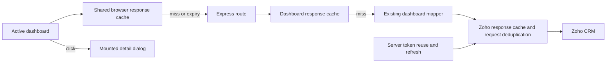

# Monitoring Review system design

The dashboard should reuse CRM data for 30 minutes, request only the active view, and show compact summaries with details on demand. These changes address repeated network and mapping work while retaining the existing API contracts and business calculations.

This document follows the information structure of the retained System Design template. It records implementation decisions and acceptance checks. No benchmark is implied by the design.

## 1 Abstract

The local application has a React and Vite frontend on port 5174 and an Express API on port 4010. The API reads Zoho CRM and computes reporting populations. The user-facing performance problem spans three separate costs: CRM reads, aggregation, and browser rendering. Caching reduces the first two; lazily mounting dashboards and drilldowns reduces the third. Splitting one component into several divs alone does not prevent an API request.

## 2 Goals and non goals

| Goal | Acceptance condition |
| --- | --- |
| Reuse data for 30 minutes | Repeat visits with the same filters use a valid cached response. |
| Avoid duplicate reads | Concurrent equivalent requests share one in-flight operation. |
| Keep credentials on the API | Browser requests never contain Zoho client secrets or refresh tokens. |
| Load the current board only | Opening Design or PDI does not start the Pre Sales request. |
| Keep efficiency compact | Cards expose the critical figure and comparison; details open on demand. |
| Improve maintenance | Cache, request logic and efficiency components have explicit ownership. |

This work does not redefine CRM milestones, correct historical source records, or certify the mapping issues in the preceding audit. It does not introduce a database, queue, or distributed cache for a single local server.

## 3 Background and problem statement

At inspection, `frontend/src/hooks/useDashboard.js` fetched whenever an enabled hook mounted or its filter serialization changed. It did not retain a shared response across unmounts. `frontend/src/App.jsx` enabled the Pre Sales query on every tab except Sales, including unrelated operational dashboards. The Sales board also kept its funnel request enabled when viewing Efficiency.

The Zoho client already reused its access token until expiry, persisted it locally, and combined concurrent token refreshes. Data caching was independent: the response cache was 60 seconds. A long first read could involve many CRM pages, and re-entering a board repeated some of that work. OAuth lifetime should continue to follow the provider's expiry; the requested 30-minute schedule is a data-refresh policy.

## 4 Architecture



Core responsibilities:

| Boundary | Responsibility |
| --- | --- |
| Browser cache | Normalize endpoint and filter keys; reuse a fresh response; combine identical requests; preserve loading and error states. |
| Dashboard hook | Subscribe the visible component, schedule expiry refresh, and expose explicit refresh. |
| API response cache | Avoid rebuilding identical dashboards inside the data freshness window. |
| CRM transport | Cache equivalent source reads and combine concurrent misses without exposing credentials. |
| Mappers | Preserve reporting windows, units, record identities, and existing business formulas. |
| Efficiency components | Separate compact metric summaries, suitable small charts, and detailed tables. |

## 5 Request lifecycle

1. The active board supplies endpoint, reporting period, and supported filters.
2. The browser normalizes the key so query parameter ordering cannot create duplicate cache entries.
3. A fresh entry renders immediately. A miss joins an equivalent in-flight request or starts one.
4. The API validates the route inputs, checks the response cache, and reads CRM only when needed.
5. Source requests reuse their own cache entries and the valid OAuth token. Token expiry is handled separately.
6. The mapper creates the established response shape. Only successful, suitable responses become fresh cache entries.
7. The browser records freshness, schedules the next active-view refresh, and updates subscribers. Detail dialogs mount when selected.

A manual refresh must have a documented cache-bypass policy. It must not allow an older in-flight response to overwrite newer data. Leaving a view should detach that view without cancelling a shared request still used elsewhere.

## 6 API and data contracts

The principal read endpoints remain `/api/dashboard`, `/api/sales-funnel`, `/api/sales-efficiency`, `/api/pre-design-funnel`, `/api/post-design-dashboard`, and `/api/pdi-dashboard`.

Cache keys must distinguish endpoint, normalized reporting window, city, owner or PSM, and any other input that changes a response. Time-relative periods must not reuse yesterday's interpretation after the local reporting day changes. CRM cache keys must include module, field selection, query constraints, sort order, and page or page token.

A response timestamp means the represented source snapshot's freshness, not merely when the browser received a cached response. Cached CRM records remain a reporting copy; Zoho remains the source system. A cache entry is not evidence of complete pagination or correct business meaning.

## 7 Consistency idempotency and replay

The intended consistency model accepts up to 30 minutes of reporting lag between automatic refreshes. Simultaneous equal requests share work. Cache failures must not masquerade as fresh zero values. An unavailable refresh should preserve the last usable display only with an explicit stale or error indicator.

An in-memory response cache is scoped to one API process. Restart clears that layer, and multiple server instances would need a coordinated store if deployed later. Such a distributed service is outside the local implementation scope.

## 8 Security and privacy considerations

Zoho credentials stay in backend configuration and server token storage. They must not enter frontend bundles, cache keys sent to the browser, screenshots, or logs. Browser persistence of full CRM payloads is unnecessary; memory reuse reduces repeated reads without retaining client records across browser sessions.

Cache diagnostics should record endpoint, timing, cache state, and aggregate size rather than names, phone numbers, payment attachments, or tokens. Existing authentication and data visibility boundaries must be retained.

## 9 Operational readiness

Verify cache hit, expiry, failed refresh, simultaneous requests, manual bypass, and key separation using controlled tests. Confirm that disabling a view stops its requests and that re-entering it within the freshness window reuses data. In the browser, verify responsive card layout, keyboard activation, detail close behavior, table accessibility, and empty/unavailable values.

A production build proves imports and bundling; it does not prove CRM accuracy or a latency improvement. Performance evidence must distinguish a cold first request, an API cache hit, a browser cache hit, and an explicit refresh. Record measured timings and request counts without inventing a target result.

## 10 Alternatives considered

| Alternative | Decision |
| --- | --- |
| Separate API request per card | Avoid by default: this can multiply overlapping CRM reads and complicate reconciliation. |
| Separate divs only | Insufficient: DOM boundaries do not control fetches. Use component and request boundaries together. |
| Refresh OAuth every 30 minutes | Avoid: follow token expiry and invalid-token responses. Refresh dashboard data separately. |
| Move every file at once | Avoid: a targeted feature refactor is easier to verify and preserves unrelated work. |
| Cache indefinitely | Avoid: it conceals source updates and failure states. |

## 11 Open questions

Previously audited ambiguities remain: stage-based approvals, payment evidence, operational workload scope, and incomplete source pagination need separate correction work. A faster cache must not be described as correcting those mappings.

The maximum acceptable visible stale age after a failed refresh, and whether all boards need manual refresh controls, should be documented consistently. Performance testing should determine whether the cold-read path warrants a separately materialized reporting snapshot in a later phase.

## 12 Decision and next steps

Use incremental cache infrastructure and feature modules. Preserve API contracts while separating orchestration from rendering. Keep compact Efficiency summaries independently selectable; mount larger charts and tables in the detail view.

The implementation now provides 30-minute source and dashboard response caching, concurrent request deduplication, and expiry at the next reporting midnight where appropriate. Backend response keys include the reporting day. Browser cache entries also expire at Asia/Kolkata midnight; an old-day response is not reused as a fallback or assigned a fabricated freshness timestamp. Manual refresh sends `refresh=1`. Normal remounts reuse valid cache entries, and automatic refresh runs for the active visible view.

OAuth tokens remain server-side and follow their own expiry. The user does not need to supply an API key for each dashboard visit. Response and browser caches are in memory: API restart or browser reload respectively clears these layers, so the first read can remain slower than subsequent visits.

The frontend now separates dashboard orchestration, shared request state, shared controls, and the Sales Efficiency feature. Boards load lazily. Sales funnel fetching is disabled while Efficiency is active; the city map opens only after Show city map. Compact metric and category cards open lazily mounted detailed charts and tables. Existing unrelated components remain in place to avoid a broad migration.

### Verification status

| Check | Result |
| --- | --- |
| Backend focused tests | 16 passed, including source and dashboard cache behavior and reporting-day boundaries. |
| Frontend cache tests | 6 passed, covering shared data-cache behavior. |
| Production build | Passed after shared-control extraction and the responsive/focus fix batch; Efficiency details emit as a separate 8.00 kB chunk. |
| Browser interaction and layout verification | Desktop and 390 px mobile checked; metric and monthly details, chart/table switching, Escape and focus return verified. Clean reload produced no new browser errors. Independent finish review: pass with verification limits. |

Observed local request timings were 5,676 ms for the cold request, 10 ms for its warm repeat, 107 ms for a new city variant, and 7 ms for a repeated monthly request. These measurements demonstrate cache reuse in that local run; they are not a general latency guarantee and do not certify CRM mapping correctness.

The retained template DOCX is unchanged. A Word version is not included because the required bundled renderer is unavailable in this Windows runtime and template fidelity could not be visually verified.

### Module ownership

The following structure reflects the incremental refactor. Existing unrelated feature components remain under components.

```text
backend/src/
  config/                  Environment and approved reporting policy
  lib/cache/               Source cache, response cache and focused tests
  routes/                  HTTP validation and dashboard orchestration
  services/                Zoho transport and existing dashboard mappers
frontend/src/
  app/                     Lazy dashboard orchestration
  shared/data/             Response cache, freshness display and focused tests
  shared/ui/               Reusable RefreshButton
  lib/                     API address
  hooks/                   Dashboard subscription and refresh lifecycle
  features/sales/efficiency/
                            Summary cards, details, charts and formatting
  components/              Shared controls and existing board components
  styles/                  Global design tokens and shared layout
docs/architecture/        System design and operating decisions
```

Keep imports acyclic: feature UI may use shared components, but shared components should not import a feature implementation. Keep a temporary compatibility export if moving an established component path. Co-locate feature-only styles with the feature; retain shared typography, layout and tokens centrally. Separate tests by the behavior they prove, without moving unrelated business services merely for visual consistency.

### Implemented modules

- `backend/src/lib/cache/`: source read cache, dashboard response middleware, reporting-day helpers, and tests.
- `frontend/src/app/DashboardApp.jsx`: active dashboard orchestration; `frontend/src/App.jsx` preserves its import entry point through a re-export.
- `frontend/src/shared/data/dashboardCache.js`: browser request reuse, deduplication and freshness; `dashboardCache.test.js` verifies behavior.
- `frontend/src/shared/data/DataFreshness.jsx`: shared freshness presentation.
- `frontend/src/shared/ui/RefreshButton.jsx`: shared refresh control.
- `frontend/src/features/sales/efficiency/`: `MetricCard.jsx`, `EfficiencyMargin.jsx`, `EfficiencyDetails.jsx`, `TrendChart.jsx`, and `format.js` separate summaries, detailed visuals and formatting.

